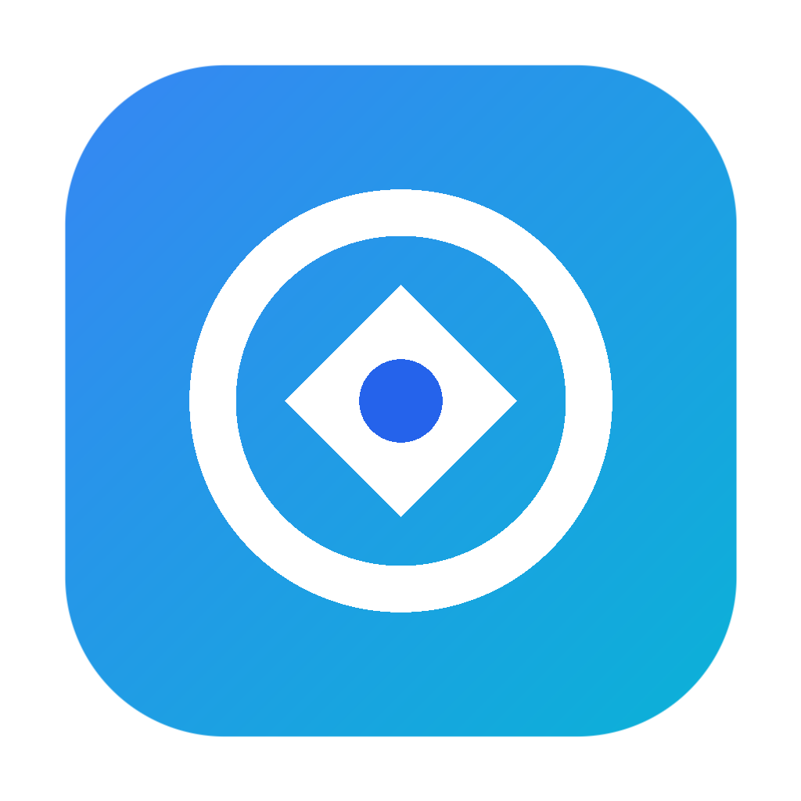

# Open-Shop

> **Open-Shop** is an advanced in-browser photo and vector graphics editor supporting PSD, XCF, Sketch, and standard image formats with zero ads, zero telemetry, and 100% offline capability.

<p align="center">
  
</p>

---

## 📖 About Open-Shop

Open-Shop provides a fully featured, layer-based graphics editing environment directly inside modern web browsers. It eliminates third-party trackers, external advertising sidebars, and forced account paywalls to deliver a clean, fast, full-width creative workspace.

---

## 🚀 How to Use Open-Shop

### 1. Running the Editor

Open-Shop is 100% client-side and requires no build step.

#### Quick Run with Node.js
```bash
git clone https://github.com/pesach/Open-Shop.git
cd Open-Shop
npm start
```
Then open [http://localhost:8888](http://localhost:8888) in your browser.

#### Run with Python
```bash
python -m http.server 8888
```

#### Run with `npx serve` or any static host
```bash
npx serve -l 8888 .
```
You can also host this directly on GitHub Pages, Cloudflare Pages, Netlify, Vercel, or any static file server.

---

### 2. Creating and Opening Projects

- **New Project**: Click **New Project** on the welcome card or press `Ctrl + N` (`Cmd + N` on macOS). Specify dimensions, DPI, and background color (white, transparent, black, or custom).
- **Open from Computer**: Click **Open From Computer** or press `Ctrl + O` to open local `.psd`, `.sketch`, `.xcf`, `.ai`, `.pdf`, `.raw`, `.png`, `.jpg`, `.svg`, or other supported files.
- **Drag & Drop**: Drag any supported file directly from your file manager onto the workspace.
- **Open from URL**: Use the built-in URL loaders to fetch remote project files or templates.

---

### 3. Core Editing Capabilities

- **Layers & Hierarchy**: Full layer tree support including raster layers, folder groups, text layers, vector shapes, smart objects, adjustment layers, and layer masks.
- **Layer Styles (FX)**: Non-destructive Drop Shadow, Inner Shadow, Outer Glow, Inner Glow, Bevel & Emboss, Satin, Color Overlay, Gradient Overlay, Pattern Overlay, and Stroke.
- **Adjustment Layers**: Curves, Levels, Hue/Saturation, Color Balance, Brightness/Contrast, Exposure, Vibrance, Black & White, Invert, Posterize, and Threshold.
- **Blend Modes**: Normal, Dissolve, Darken, Multiply, Color Burn, Linear Burn, Lighten, Screen, Color Dodge, Linear Dodge, Overlay, Soft Light, Hard Light, Vivid Light, Linear Light, Pin Light, Hard Mix, Difference, Exclusion, Subtract, Divide, Hue, Saturation, Color, and Luminosity.
- **Selection Suite**: Rectangular & Elliptical Marquee, Lasso, Polygonal Lasso, Magnetic Lasso, Magic Wand, Quick Selection, and Color Range selection.
- **Retouch & Painting**: Brush tool with pressure sensitivity, Pencil, Clone Stamp, Healing Brush, Patch Tool, Eraser, Dodge, Burn, Smudge, Blur, Sharpen, and Sponge.
- **Vector Tools**: Pen tool with Bezier curves, Freeform Pen, Rectangle, Rounded Rectangle, Ellipse, Polygon, Line, and Custom Shapes (`.csh`).
- **Typography**: Text engine supporting custom font uploads (`.ttf`, `.otf`, `.woff`), character spacing, kerning, leading, paragraph alignments, and warped text.
- **Filters**: WebGL-accelerated Gaussian Blur, Motion Blur, Radial Blur, Unsharp Mask, High Pass, Find Edges, Pixelate, Distort, and Stylize filters.

---

### 4. Exporting Your Work

- **Save as PSD**: Select `File > Save as PSD` (`Ctrl + S`) to preserve the entire layer stack, masks, and non-destructive styles.
- **Export As**: Select `File > Export as` and choose from:
  - **Raster Formats**: PNG, JPG, GIF, WebP, BMP, TIFF, ICO, DDS, TGA
  - **Vector Formats**: SVG, PDF, EPS, DXF
- **Quick Export**: Use the top bar buttons for 1-click PNG or SVG export.

---

### 5. 🤖 Agent Automation & Programmatic Control

Open-Shop includes a built-in agent automation interface (`window.OpenShopAgent`) for headless workflows, AI agent orchestration, and custom extensions.

```javascript
// Inspect active document & layers
const doc = window.OpenShopAgent.getActiveDocument();
console.log(doc.name, doc.width, doc.height, doc.layers);

// Programmatic layer adjustments
await window.OpenShopAgent.setLayerProperties(0, { opacity: 80, visible: true });

// Export document directly to binary ArrayBuffer
const pngBuffer = await window.OpenShopAgent.exportDocument('png');

// Check real-time memory usage
const memory = window.OpenShopAgent.getMemoryStats();
console.log(`Heap: ${memory.heapUsedMB} MB`);
```

External windows and parent frames can also dispatch structured commands via `postMessage`:
```javascript
editorWindow.postMessage({
  type: 'openshop:agent-command',
  id: 'cmd_1',
  command: 'exportDocument',
  params: { format: 'png' }
}, '*');
```

---

### 6. 🛡️ Crash Recovery & Memory Safety

- **IndexedDB Autosave**: Automatically snapshots the active project in the background every 45s. In case of accidental tab close or browser crash, a restore banner offers 1-click recovery.
- **Memory Guard**: Continuously tracks JS heap usage and resolution boundaries to protect the browser tab from unexpected out-of-memory terminations.

---

## 🛠️ Technology Stack & Architecture

Open-Shop runs entirely on standard web standards without heavyweight frontend frameworks or proprietary native plugins.

```
┌────────────────────────────────────────────────────────────┐
│                      Open-Shop Shell                       │
│        (DOM Tree, Workspace Panels, Modal Dialogs)         │
├─────────────────────────────┬──────────────────────────────┤
│       2D Canvas Engine      │      WebGL Shader Engine     │
│   (Viewport, Path Rendering,│   (Live GPU Filter Pipeline, │
│    Transforms, Tool UI)     │    Real-time Color Blends)   │
├─────────────────────────────┴──────────────────────────────┤
│                   Core Processing Pipeline                  │
│  - Custom Bytecode Dispatcher                              │
│  - TypedArray Pixel Buffers (Uint8Array, Float32Array)     │
│  - Web Workers (Background parsing & async rendering)      │
├────────────────────────────────────────────────────────────┤
│                    Format Parsers & Codecs                 │
│  - PSD/PSB Parser & Serializer (Layer & Mask Engine)       │
│  - UZIP (High-performance DEFLATE compression engine)      │
│  - UPNG (Optimized APNG / PNG encoder & decoder)           │
│  - UTIF (TIFF and RAW digital camera decoding)             │
│  - Vector Bezier Tessellator (SVG / Sketch / Path Engine)  │
└────────────────────────────────────────────────────────────┘
```

### Core Technologies:

1. **HTML5 Canvas & WebGL**:
   - Uses the Canvas 2D API for coordinate transformations, vector path manipulation, rulers, guides, and UI overlays.
   - Utilizes custom WebGL fragment and vertex shaders for GPU-accelerated filter execution (e.g. blurs, color grading, matrix convolutions) and real-time blending calculations.

2. **Binary Stream Parsers & Low-Level Byte Engines**:
   - Comprehensive binary readers and writers for Adobe Photoshop `.psd` / `.psb` specifications, including layer records, channel image data, resource blocks, and adjustment layer descriptors.
   - Vector format parsers for Sketch JSON bundles, SVG paths, Adobe Illustrator (`.ai`) streams, and GIMP `.xcf` structures.

3. **Built-in Compression & Codec Modules**:
   - **`UPNG.js`**: Advanced PNG encoder/decoder supporting 8-bit, 16-bit, and indexed color spaces with lossy and lossless quantization.
   - **`UZIP.js`**: Lightweight, high-speed DEFLATE, INFLATE, and ZIP package manager for archive parsing.
   - **`UTIF.js`**: Comprehensive TIFF and camera RAW format decoder.

4. **Typed Arrays & Memory Management**:
   - Uses `ArrayBuffer`, `Uint8ClampedArray`, `Uint32Array`, and `Float32Array` structures to perform zero-copy raster calculations, planar channel operations, and SIMD-friendly memory access patterns.

5. **Self-Contained & Zero Dependencies**:
   - No external NPM runtime dependencies.
   - No analytics, tracking scripts, or ad networks.
   - Clean, sandboxed execution that runs fully offline.

---

## 📄 License

Open-Shop is licensed under the MIT License.
