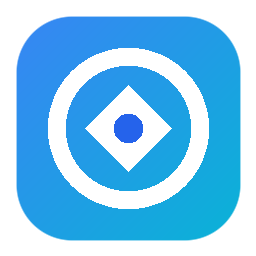

# OpenShop Web

> Advanced in-browser raster and vector graphics editor supporting PSD, XCF, Sketch, and standard image formats.



## Overview

**OpenShop Web** is a complete, self-contained, high-performance web-based image and photo editor. It runs 100% client-side in any modern web browser without requiring installation, plugins, external tracking, or third-party ads.

## Key Features

- **Format Compatibility**: Open and save PSD (Photoshop), XCF (GIMP), Sketch, RAW, SVG, PNG, JPG, GIF, WebP, TIFF, and BMP formats.
- **Full Layer Pipeline**: Raster layers, text layers, vector shape layers, smart objects, layer masks, adjustment layers, layer styles (drop shadows, color overlays, strokes), and blend modes.
- **Complete Tool Palette**: Brushes, pencils, healing tools, clone stamp, gradient/bucket fill, eraser, dodge/burn/sponge, vector pen, shape tools, magic wand, quick selection, and free transform.
- **Color & Adjustment Engines**: Curves, Levels, Hue/Saturation, Color Balance, Brightness/Contrast, Exposure, Vibrance, Invert, Posterize, and Threshold.
- **Filter Suite**: Gaussian blur, motion blur, sharpen, noise, pixelate, distort, stylize, and render filters with live GPU-accelerated WebGL preview.
- **Brush & Preset Support**: Load Photoshop brush files (`.abr`), patterns (`.pat`), gradients (`.grd`), and custom shapes (`.csh`).
- **Privacy & Offline First**: 100% local in-browser processing. Zero tracking, zero telemetry, and zero ads.

## Quick Start

### Option 1: Direct File Opening
Open `index.html` directly in any modern desktop or mobile web browser.

### Option 2: Local Web Server
```bash
# Start with built-in Node server
npm start

# Or with npx serve
npx serve .
```
Then visit [http://localhost:8888](http://localhost:8888) in your browser.

## License

MIT License.
